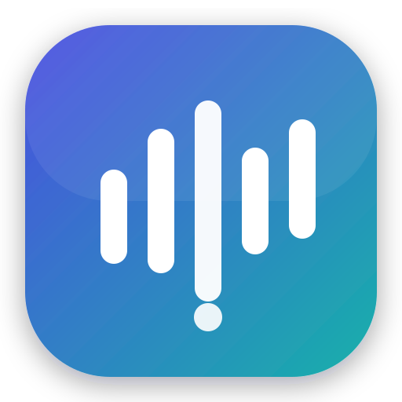

<p align="center">
  
</p>

<h1 align="center">SK Note Taker</h1>

<p align="center">
  <b>AI meeting notes for Mac — with real speaker identification.</b><br/>
  Granola-style botless capture, on-device transcription, per-speaker attribution,<br/>
  intelligent summaries via your Claude Code subscription, MCP access, and a LAN web view.
</p>

---

## Why

Granola is great, but on desktop it only knows "Me" vs "Them" — every remote participant
collapses into one anonymous voice, and the audio is discarded after transcription.
SK Note Taker fixes both, keeps everything local, and uses the Claude Code CLI you already
pay for instead of a metered API.

| | Granola (desktop) | SK Note Taker |
|---|---|---|
| Botless mic + system-audio capture | ✅ | ✅ |
| Real-time transcription | ✅ cloud (AssemblyAI/Deepgram) | ✅ **on-device** (Apple SpeechAnalyzer) |
| **Speaker identification** | ❌ Me/Them only | ✅ **Speaker 1..N diarization (FluidAudio, on-device)** |
| Name speakers ("S2 = Kainat") | ❌ | ✅ instant, metadata-only rename |
| Meeting audio recording + playback | ❌ discarded | ✅ full m4a kept locally |
| AI summaries (action items, decisions, things to remember) | ✅ their backend | ✅ **your Claude Code subscription** |
| Chat with a meeting ("What did Kainat say?") | ✅ | ✅ |
| Auto-organization into client/project folders | manual/rules | ✅ AI auto-categorization |
| MCP server | ✅ hosted, paid plans | ✅ local, free |
| Web review app | view-only cloud | ✅ local LAN (phone-friendly) |
| Your data | their cloud | **your disk** (`~/Library/Application Support/SKNoteTaker`) |

## Components

```
app/   Swift 6 / SwiftUI macOS app (capture, live diarized transcript, notes, AI, playback)
mcp/   TypeScript MCP stdio server (meetings/transcripts/summaries for any MCP client)
web/   Node web app on http://<your-mac>:4517 — review meetings from any device
```

## Requirements

- macOS 26+ (SpeechAnalyzer APIs), Apple Silicon recommended
- Xcode 26 toolchain (to build)
- [Claude Code CLI](https://claude.com/claude-code) installed and signed in (for AI features)
- Node 22+ (for MCP server and web view)

## Build & install the Mac app

```bash
cd app
./scripts/build-app.sh          # builds + signs dist/SK Note Taker.app
open dist                        # drag "SK Note Taker.app" to /Applications if you like
open "dist/SK Note Taker.app"
```

### First run — permissions

On first launch a short **onboarding walkthrough** asks for the two grants and shows live
status for each:

1. **Microphone** — transcribes your voice (Speaker 1). Click **Allow** on the macOS prompt.
2. **System Audio Recording** — transcribes everyone else. Grant under System Settings →
   Privacy & Security → Screen & System Audio Recording → System Audio.
3. On-device models download automatically on the first meeting (speech + diarization, once).

You can re-check or re-request either permission any time in **Settings → Permissions**. While
recording, the header shows a **live level meter for each channel** (mic and system) so you can
confirm audio is actually arriving, and a banner warns you if the mic stays silent.

### Troubleshooting: microphone not working / no prompt appeared

If you never saw the mic prompt or your voice isn't transcribed:

1. **Settings → Permissions → Microphone** shows the current state; use **Request** or **Open
   Settings** there.
2. Reset the grant so the prompt fires fresh:
   ```bash
   tccutil reset Microphone com.saqibkamran.sknotetaker
   ```
   then start a meeting again.
3. Confirm the mic hardware works with the bundled diagnostic (run from Terminal, which has its
   own mic permission), speaking or playing audio during the window:
   ```bash
   cd app && swift run sknote-audiocheck mic 6
   # ✅ SIGNAL PRESENT on mic.   → mic hardware + capture path OK
   # ❌ SILENT                   → mic is muted or not permitted
   ```
   `sknote-audiocheck both 8` checks mic **and** system audio at once.

> Note: SK Note Taker intentionally does **not** use Apple voice processing on the mic — that
> mode only delivers audio when an output render chain is active, which a capture-only app has
> none of, and it silently produced zero audio. We capture the raw mic instead.

### Using it

- **Start Meeting** (⌘N) — live transcript appears with per-speaker colors; jot rough notes
  in the right pane (they become anchors for the AI summary).
- **End Meeting** — final diarization pass runs, audio is saved.
- **Speakers** — assign names (Speaker 2 → "Kainat"); transcripts, summaries, chat, MCP and
  web all use the names immediately.
- **Summary tab → Generate Summary** — TL;DR, action items (with owners), decisions,
  things to remember.
- **Chat tab** — "What did Kainat say about the deadline?"
- Meetings auto-file into **client/project folders** after they end (editable).

## MCP server

```bash
cd mcp && npm install && npm run build
claude mcp add sk-note-taker -- node "$(pwd)/dist/server.js"
```

Tools: `list_meetings`, `get_meeting`, `get_transcript`, `get_summary`,
`search_meetings`, `list_folders`. Works with any MCP client (Claude Code, Claude
Desktop, Cursor…).

## Web view

```bash
cd web && npm install && npm start
# open http://localhost:4517  (or http://<mac-ip>:4517 from your phone)
```

Browse folders, read summaries/transcripts/notes, play recordings, rename speakers,
and move meetings between folders.

## Testing

```bash
cd app && swift test                                   # unit tests
SKNOTE_INTEGRATION=1 swift test                        # + full pipeline over synthetic audio
cd mcp && npm test
cd web && npm test
```

Test reports live in `tests/reports/`.

## Architecture (short version)

Dual audio streams — mic (AVAudioEngine + echo cancellation) and system output (Core Audio
process tap) — each feed an on-device SpeechTranscriber; the system stream also feeds
FluidAudio's CoreML diarizer. A merge step attributes finalized ASR tokens to diarized
speakers (mic = S1 by construction; S2..Sn from clustering) and coalesces utterances.
AI features shell out to `claude -p --output-format json` with structured-output schemas.
The MCP server and web app are thin readers of the same JSON data directory.

Full details in [`docs/planning/`](docs/planning/).

## v2 backlog

Calendar integration & meeting auto-detection, note templates, share links,
multi-meeting chat, Slack/Notion export, iOS companion, cloud sync, live
speaker-name suggestions from voice enrollment.

## License

MIT — see [LICENSE](LICENSE).
